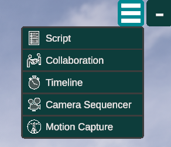

# Face Capture

Facial animation can really bring a character to life. FirstStage lets you use an iPhone X or later (must support face tracking) to capture facial animation. It works by running a **companion app** __ on your which connects to FirstStage and sends it the facial animation data.


[setting-up-facial-capture.md](setting-up-facial-capture.md)


Face Capture is controlled from the [desktop](../../../basics/using-firststage-on-the-desktop.md) rather than VR as the input is coming from a phone or tablet. If the Motion Capture window is not showing go to the drop down menu (top right) and click on it to make it appear.

<figure><figcaption></figcaption></figure>

Facial animation will only work with puppets with suitable blendshapes on the face (see \[Importing a Character] for details). Some puppets may only have a jaw bone to animate the face: for these you will at least get basic “mouth flap” which may be sufficient for background characters. Most of the standard FirstStage character assets work with facial animation as do characters from ReadyPlayerMe or Reallusion Character Creator.


It is usually helpful to set up a camera in close up on the character's face. Then show the Camera Sequencer as well and select that camera so you can monitor your character's face.


<figure><figcaption></figcaption></figure>

### Assign a Character 

The Motion Capture window should now show a source for your device in the left hand column. If you select it (if it’s the only one, it will be selected by default) the right hand pane will show the device name and a drop down menu which will allow you to assign the device to one of your characters. Initially it will be Unassigned. Choose the character for which you’d like to record some facial animation.

It is often helpful to create a camera targetting your character in close up. Then select that camera in the \[Camera Sequencer] so you can see how your character is responding to your facial performance.

### Filters 

Every character responds to facial animation differently depending on how it is rigged and the quality of its facial blendshapes. You can tailor your performance to the puppet but to make it easier, each of the main areas of the face - Jaw, Mouth, Eyes, Brows, Cheeks and Tongue - has a filter applied.

For each facial channel, there is a slider where you can set the range of expression to be used: if your character is prone to extreme expressions, reduce the upper limit; if your character seems to mumble, raise the lower limit. Underneath each slider, there is also a dial that lets you set the gain on each channel: gain is applied after the range reduction.

Experiment to get the best match between your expressions and the character’s.

### Record Voice 

You can either record the performer’s voice at the same time or simply “mouth over” an existing dialogue track (or music track).

### Recording the Performance 

Simply press Record on the [Transport Controls](broken-reference) to record the performance and then press stop when done.

Afterwards, there will be a Face Mocap activity on the timeline for that character. You can move it about freely and you can also trim it to remove any start up or cool down.


The mocap device has a **Record Arm** button on it. This shows red when enabled. It is automatically disabled after each performance as otherwise you will not be able to replay your recent performance. Click on it to re-enable it if you want to retake your facial capture or record another section.

