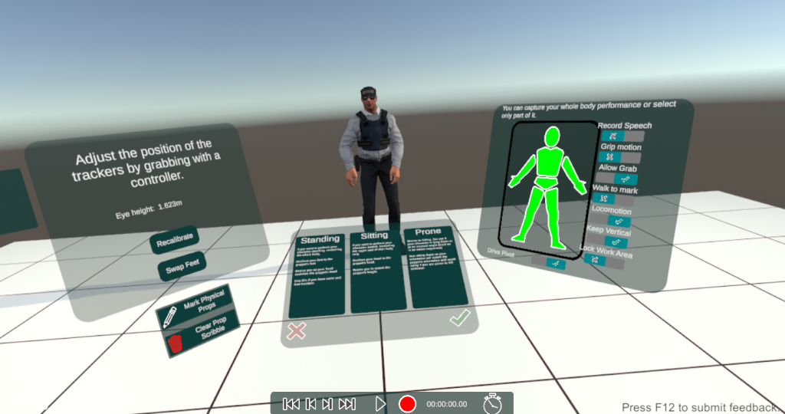

# Motion Capture (VRIK)

FirstStage provides a simple but effective form of motion capture inside VR using the headset and controllers to control a character via inverse kinematics (IK). This only really drives the upper body of the character, but the system will try to guess which way you are walking and apply suitable animations to the waist and legs.

You can also use additional Vive trackers attached to your feet (or ankles) and waist to drive them directly.

Note that using trackers and VRIK has some significant limitations: it does not know where your elbows and knees are so has to make a guess. The result usually looks reasonable but may not be what you actually performed. For example, flapping your elbows while keeping hands stationary will not be captured correctly. Human shoulders are actually quite complicated but most puppets do not rig them well, and even if they did, we have no trackers on them so must infer the actual movement.

If you need to capture more subtle performances, FirstStage also supports the [Rokoko SmartSuit](https://www.rokoko.com/products/smartsuit-pro) which uses lots of inertial trackers placed over the body suit to capture many more components of motion. This has different limitations as it can be prone to long chain errors such as clapping your hands where they may not meet correctly in the playback.

### Taking Control of a Puppet 

To start, point at a puppet with the Navigator (the default left hand tool) when you should see the target teleport destination change to show Take Control over the character’s head. Click & hold the trigger (you’ll see a confirmation timer) and, blink, you’ll be in the Mocap Setup space, a little bubble separate from the rest of the stage.

.png>)

## Mocap Setup 

Once in the Mocap Setup space, you’ll see a puppet opposite you which should mirror your actions as you move. If you look down you will also see that you have the puppet as your body.

<figure><figcaption></figcaption></figure>

In front of you is a panel with a choice of motion capture scenarios: one of these is often a good choice.

There are two buttons at the bottom of the middle panel: click on the tick when you are ready to start performing and click on the cross to cancel mocap and go back out to the scene.

To your left is a panel where you can calibrate your height against the height of the puppet which will improve the quality of mocap.

To your right is a panel which gives you fine control of how your performance will drive the puppet.

For your first time, just click the tick and, blink, you’ll be back on set performing inside your character.

### Calibration 

When you first Mocap Setup, you will be asked to calibrate your height by looking at a target in front of you. You can redo this calibration any time by clicking on the **Recalibrate** button.

If you look at your hands, you should see your real hands and the puppet’s hands aligned. Usually this works fine but for some puppets this might not be quite right - particularly those with outsized, cartoony hands. In which case, use your other hand to grab the transparent red sphere which acts as a handle to move the puppet’s hands relative to your hands.

If you are using trackers for your feet and waist, they will also show in the Mocap Setup space and you can also adjust the relative position of your real feet and the puppet’s feet. In practice, you may need to adjust your feet more often as it will depend on where exactly you strapped the trackers to your feet or ankles.

If you are using feet trackers, it is easy to put the left foot tracker on your right foot and vice versa leading to crossed legs. If so, click on the **Swap Feet** button to swap the tracker mapping and you should see your puppet with straight legs.

### Mocap Scenarios 

Depending on what type of performance you are wanting to capture, one of the standard scenarios is a good place to start. The panel on the right will show the details of this selection.

#### Standing 

This is the most common scenario: the performer is standing and we want to capture the motion of all body parts.

Any previous animation - either mocap or poses - will be overridden and will not play out during the mocap recording.

If the performer does not have feet and waist trackers, then automatic locomotion will be applied: small steps to keep the puppet’s hips mostly under the puppet’s head.

#### Sitting 

Sometimes it is convenient or more comfortable for the performer to sit. For example, the puppet may be posed in a sitting position and we only want to capture the upper body motion. Another case may be where we have animated the puppet moving: if the puppet is moving without the performer’s control this can be very uncomfortable when standing unless you have very good VR legs.

#### Prone 

This is very similar to the Sitting scenario, except that it does not keep the performer’s head vertical and the head will follow the puppet’s pivot. Be warned, if the puppet is thrown around or is spinning, this can be most uncomfortable!

### Masking 

If you are layering a performance on top of an existing performance or pose animation, it is useful to turn off those body parts you want to keep from the base layer.

You can select which body parts are driven by clicking on the body mask illustration: head, chest, pelvis, arms, hands, legs & feet.

#### Drive Pivot 

As well as the pose of the body and limbs, motion capture also records the position and orientation of the body pivot which describes how the puppet moves through space.

Turn this off when layering a performance on top of a base animation that moves the body. Or if the base pose is stationary but you do not want the body to move, for example, when sitting.

### Other Options 

#### Record Speech 

When enabled, speech will be recorded (via the headset mic by default) and appear as a separate track on the timeline. Useful if you want to record placeholder dialogue.

#### Grip Motion 

When enabled, you can move yourself & your puppet using the controller grips as you would outside mocap. This can be useful if you want to rough out someone climbing.

#### Allow Grab 

When enabled, you can grab props that have been set as **Holdable** in the Inspector. It is off by default to avoid accidentally picking things up.

#### Walk to Mark 

When enabled, you can use your off-hand controller to point somewhere to walk to and then press the up button to walk there.

#### Locomotion 

When enabled, the puppet will automatically move to keep the pelvis beneath the head as you move around the work area.

Locomotion is automatically disabled if you have feet trackers on.

#### Keep Vertical 

When enabled, the performer will remain vertical in the world regardless of whether the puppet is. However this will not give the right results if your character is attached to a moving object that is not keeping vertical. Turn this off with caution as it can lead to discomfort if you do not have good VR legs.

#### Lock Work Area 

When enabled, the performer will not be teleported to the puppet at the start of the performance.

This is useful if you have physical props in your work area and want to preserve their alignment to their virtual counterparts in the virtual space.

This is also really useful when you have two performers in the same physical space and want to keep their relative positions. It will also align the work areas to ensure all performers are in the same physical and virtual spaces.

### Physical Props 

It can be useful to have physical props to interact with: for example a performer could put their foot on a cardboard box to match a speaker monitor in the virtual world; or some physical steps could allow the performer to climb virtual stairs.

If you have such physical props, click on the **Mark Physical Props** button to activate the scribble tool. Use this to mark the outlines of physical props: this will now remain fix with respect to your work area.

Click on **Clear Prop Scribble** to remove the markup.

## &#x20;
