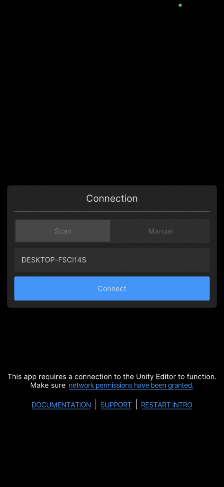
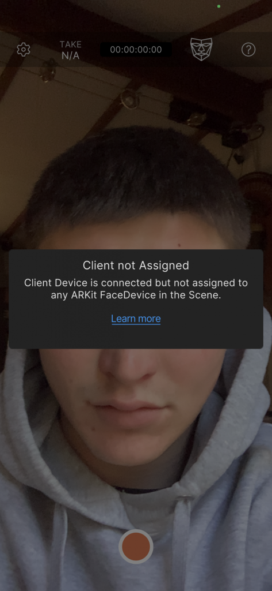

# Setting up Facial Capture

You will need to install the [Unity Face Capture app](https://apps.apple.com/us/app/unity-face-capture/id1544159771) on your phone to do so.


It is only available on iPhone or iPad with:\
• iOS 14.6 or higher\
• ARKit face tracking capabilities ([device supporting Face ID](https://support.apple.com/en-us/HT209183) **or** [device with an A12 Bionic chip](https://en.wikipedia.org/wiki/Apple\_A12))


### **Network requirements**

* Your mobile devices and your Unity Editor workstation must have access to the **same network**.
* You must **disable** any active **VPNs**.
* On Windows 10, you must set your **Wi-Fi** network to **Private**.
* Your **firewall** must allow your Unity Editor program to get **inbound connections** from external apps of your local network.

Start the Face Capture app when FirstStage is already running and it should offer to connect to your computer. Press the **Connect** button to do so.

<figure><figcaption></figcaption></figure>

 

<figure><figcaption></figcaption></figure>

