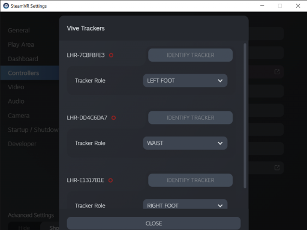

# Setting up Vive Trackers

### Configure Trackers with SteamVR

Make sure your trackers are charged and have connected with SteamVR (their lights will glow green).

Go to the SteamVR status window and select Devices > Manage Vive Trackers from the menu (top left).

Identify each tracker in turn and select the appropriate Tracker Role: left and right feet and waist.

<figure><figcaption></figcaption></figure>

### Fit the trackers

You can attach trackers to the top of your feet or to your ankles: we often find ankles work best.

The waist tracker can face forwards or backwards depending on what you want to perform: remember the tracker needs to be visible to the base stations.

<figure><figcaption></figcaption></figure>

### Capturing Performance

It is easy to capture performance in FirstStage: the process is mostly the same as capturing performance with just headset and controllers.

1. Create a character and place it on set.
2. Point at the character with the Navigator tool (default left hand) and pull the trigger to Perform.
3. Inside the Mocap Setup Room you can check that the trackers are working correctly.
4. It is not uncommon to have the feet on the wrong way round: if so, press the Swap Feet button on the left hand panel.
5. You can adjust the position of the trackers relative to your feet and waist by pointing at and grabbing the tracker.
6. Once you are setup, press the green tick to start.
