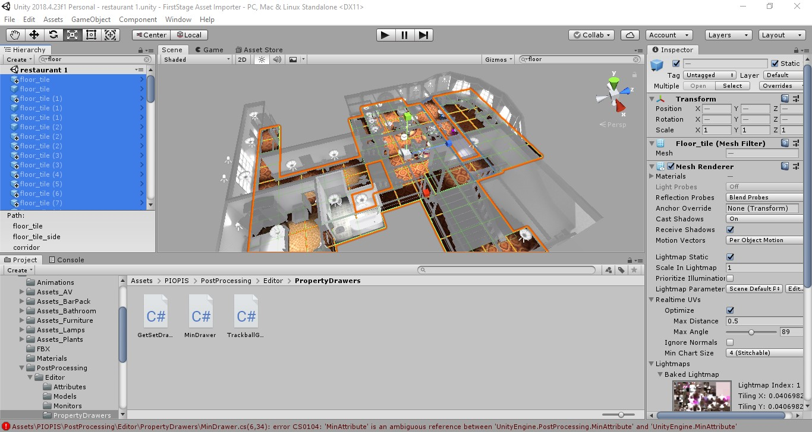

# Prepare Assets for FirstStage

This guide will illustrate how to prepare assets and scenes for use in FirstStage

All imported individual Assets and whole Scenes will possibly require

* Organise the folder scheme
* Fix any obvious issues

Whole Scenes will also require:

* Setting floor layers
* Remove existing cameras
* Set the inital spawn point

Optionally, Scenes can be processed to extract all the Assets used within the Scene, and make the Assets available for use in other FirstStage Scenes. This will require:

* Separate and import Scene assets
* Identify Stage asset

_NB - After any fixes are done in the Unity Editor, for speed and efficiency we recommend that you always first export to a LOCAL FirstStage repository, and then once reviewed and approved, exxport to a cloud-based FirstStage Project repository._

#### Duplicating files

It is worth duplicating package contents when you plan to make amendments before import, so that you retain a copy of the original file. Copying files is best done by selecting them, then pressing Ctrl-D on your keyboard to create a duplicate.

### Organise the folder scheme

The name of the asset and the folder it is in will be preserved when the asset is committed to the repository, so it can be helpful to choose a scheme that mirrors your source asset structure. Generally the top level folder should be something that identifies the publisher, as you may end up inporting a number of assets from that source.

_NB - For Max/Maya users, it may help to choose a scheme that mirrors your source asset structure._

## Preparing All Assets

<figure><figcaption>
1.1.1 - Create suitable scheme and select
</figcaption></figure>

1. Click on the Create drop down in the Project window tool bar and select Folder, then name the new folder after the publisher “Gnarly Potato”.
2. Drag asset package folder (‘Japanese Coin’) onto the publisher folder (‘Gnarly Potato’) to establish a folder scheme.

### Fix any obvious issues

To thoroughly inspect the asset before import, you will want to review the files included in the asset package, and the visual appearance of the asset.

To do this, you will need to open the sample scene to allow scrutiny of all the assets in the bundle.

1. In the Project window (bottom left as standard), select the asset folder to import and double-click the scene file (in this case called ‘presentation’) to open it.\
   You can now view the scene elements in the Hierarchy window
2. To visually preview the assets in the Scene window, double-click each asset GameObject in the Hierarchy window (‘coin’ or ‘coin pile’).

Issues that you may notice in the Unity Editor will likely be visual in the Scene window, and organisational in the Project window, such as:

* Missing Textures
* Missing prefab

For instructions on how to see and fix those and others, go to [Fixing Common Issues](https://firststage.moviestorm.co.uk/knowledgebase/5-fix-common-issues/)

## Preparing whole Scenes

### Set floor layers

If your asset has surfaces that would represent the ground level for your characters to stand on, such as floors and stairs, or even the inside of a bus, we need to mark the floor geometry so that FirstStage can identify it. Unity does this by putting objects into different [layers](https://docs.unity3d.com/Manual/Layers.html).

<figure><figcaption></figcaption></figure>

1. Double-click the scene file in the Project window so that it opens up in the Hierarchy window
2. Locate the assets that make up the floor.\
   Try searching for expected file names, like “floor” or “stairs” in the search box at the top of the Hierarchy window.
3. In the Hierarchy window multiple-select all the relevant files, then click on the Layer selection button in the Inspector window and select ‘Ground’ from the drop-down.
4. When the Unity Editor asks whether it should do this for children also, click ‘Yes, change children’ so that any nested assets within those floor assets also get marked as Ground.


If you are not using our Asset Importer template or if there is otherwise no _Ground_ Layer listed, create a new one by going to selecting ‘Add Layer…’ at the bottom of the drop down. It **must** be _User Layer 11_.


### Remove existing cameras

Example scenes often have a Player GameObject (often named ‘Player’ or ‘Controller’) to demonstrate the scene. If the scene has one, or a camera rig, these objects should be removed as they will conflict with FirstStage when loaded.

<figure><figcaption>
2.2.1 - Find and remove existing cameras
</figcaption></figure>

1. Locate any Player GameObjects or Cameras in the scene.\
   Try searching for “player”, “game”, “controller” or “camera” in the Hierarch in the Hierarchy window.\
   Selecting one should cause them to appear in the Scene window as a grey GameObject cube with coloured axes, that when selected in that view spawns a CameraPreview.
2. Right click on the relevant asset in the Inspector window and select ‘Delete’.

### Set the inital spawn point

In order to arrive in a good position in the scene, we need that position.

1. In the Hierarchy window select the Scene root folder.
2. Click on Create in the Hierarchy window toolbar and select ‘Create Empty’.\
   This will create a GameObject asset in the scene list in the Hierarchy window.
3. Right-click the new GameObject and select Rename\
   Rename it to "LOCAL\_USER”.
4. With LOCAL\_USER GameObject selected in the Hierarchy window, move it to the correct place to spawn when entering the scene.
   1. Place it at ground level by changing the Transform Poistion Y value to ‘0’
   2. Movie it to a suitable position in the scene by changing the X and Z values.
   3. Change the direction of view when spawned by changing ??? _**- CAN THIS BE DONE???**_

## Extracting Assets from Scenes

### Separate and import Scene assets

If you import a scene and notice that some of the props (e.g., tables, chairs) are just static set dressing but need to be interacted with (e.g. moved, deleted, etc.), you need to import their prefabs separately from the scene file. This has the additional advantage of adding those assets to your inventory to be individually selected in the Asset Browser and used in other sets.

1. In the Project window, select the scene’s root folder and search for ‘prefab’ in the search box.\
   You will likely find a series of categorised folders called ‘Prefabs’ with all the scene’s assets in them
2. **Follow the** [**Prepare for FirstStage**](https://firststage.moviestorm.co.uk/asset-management/2-prepare-for-firststage/) **and** [**Export to FirstStage**](https://firststage.moviestorm.co.uk/knowledgebase/3-export-to-firststage/) **guides to set up the assets correctly before importing them, either individually or in batches.**\
   This will include checking for obvious issues such as missingf textures, and adding tags and a description.

_NB - Some prefabs may be part of the construction of the building and background (e.g. walls, floors, etc.). It is best to NOT import those._

### Identify Stage assets

Now the prefabs are in the repository, we can identify all the game objects in the scene that are from an asset prefab so that FirstStage can work with them.

<figure><figcaption>
3.2.1 - Identify Stage Things
</figcaption></figure>

Select the menu option Moviestorm > Identify Stage Things\
_NB - Nothing will visibly happen, but a list of identified Assets will appear in the Console window._

****
