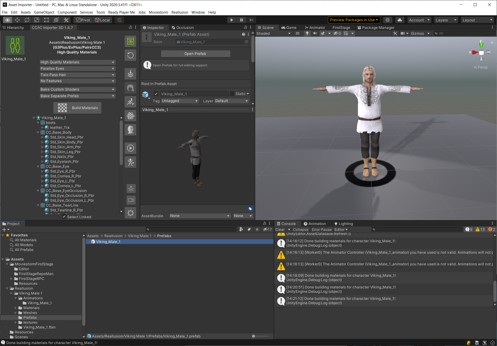

# Importing from Reallusion Character Creator™

This guide assumes you have already [set up Unity and the Asset Importer project](set-up-unity.md) so you can import assets into FirstStage.

The Asset Importer project includes the appropriate Unity Plugin from Reallusion as a package from the git repository.

## Export from Character Creator

Follow the [instructions here](https://manual.reallusion.com/CC\_and\_IC\_Auto\_Setup\_Plugin/ENU/CC\_and\_iC\_Auto\_Setup/1.0/03\_for\_Unity/Unity\_Importing\_Character\_FBX\_File.htm) to export a character suitable for import into Unity:

1. Create your character in Character Creator.
2. Go to the File > Export > FBX (Clothed Character) menu.
3. In the export wizard make sure you set the Target Tool Preset to Unity3D.
4. Click the Export button to export the character into a custom folder.

## Import the Character into Unity

1. Inside Unity, create a suitable folder in the Project view: we use "Reallusion" so we know where it came from.
2. Drag and drop the folder containing the exported character (from the previous step) into this folder.
3. Unity will now do some processing which will take a short time to import the models and materials.
4. Inside that folder you should now find an FBX object for you character.
5. You may get a pop up about NormalMap settings, in which case click on **Fix now**.

## Rig the Character

1. Next, open the CC/iC Importer tool, by going to the main menu > Reallusion > Import Characters. This is where we can decide what features to use for the character and make sure materials are correct.&#x20;
2. In the CC/iC Importer you should see the character you've just imported, but if not you can select it in the left hand column of the importer window which shows all the CC characters available. However, if the importer was already open before you imported, you may need to refresh it to see your character listed by going to the main menu > Reallusion > Import Characters to reload it.
3. The Importer tool lets you choose the quality of materials, eyes, hair, etc. and lets you choose features like cloth physics. But for now we'll go with the default settings. Press the **Build Materials** button and it will be busy for a short while rigging the character.
4. The Project view should now be showing the prefab for the new character. If you click on the top button in the right hand column of the Importer tool, it will show you your character in a new scene. Here you can have a look to see if looks ok and if not you can adjust the settings to fix it.
5. Finally, right-click on the prefab and select **Create FirstStage Puppet**: this will generate another prefab which is configured for FirstStage and is the one we will commit to the repository.&#x20;

<figure><figcaption></figcaption></figure>

For background characters, you might want to select Basic Materials, Basic Eyes, One Pass Hair and No Features. Particularly if you want to populate a scene with lots of them.

For foreground characters that will be in front of the camera, you might want to select High Quality Materials, Parallax Eyes, Two Pass Hair and Everything. However if you have too many of them in a scene, your framerate might drop uncomfortably low.

Full details of how to use the Importer tool can be found in the documentation here:



## Export the Character to FirstStage

We can now export the character to FirstStage:

1. Select the prefab you just created in the Project view.
2. Open the FirstStage Repository view (Moviestorm > FirstStage Repository if not already open).
3. Press the Import button and you should then see your new character appear under the Pending folder.
4. Select your character in the Pending folder and give it the "Character" tag in the right hand panel. It's also a good idea to tag it with "Male" or "Female" along with another tag for context such as "Viking".
5. Make sure the LOCAL repository is selected and then press the Commit button.
6. If you now start FirstStage, you should find your new character in the Asset browser by selecting Project Assets on the left.
7. If you are happy with the character, you could then choose a specific project and upload it to the cloud for everyone else working on the project to use.

## Common Issues

### Hair

Hair is really hard to get to look good an a game engine. You may want to adjust settings depending on how your hair was constructed in Character Creator and whether it is more or less thick.

1. Find the hair in the tree view in the CC/iC Importer view: it is often not helpfully labelled. In the example above it is "Group1\_001"!
2. Select the material under the hair: in the example above it was helpfully labelled "\_Transparency\_tra".
3. In the Inspector view you should see various properties controlling the hair material.&#x20;
4. Find the **Alpha Cutoff** slider. Adjust this to fit. You can often reduce it to almost zero to get it looking right from all angles.


You should not need to rebuild the FirstStage Character unless you re-import from scratch as the FS prefab references the CC prefab and should reflect any changes.

But you will need to commit it to the Asset Repository again.


####
