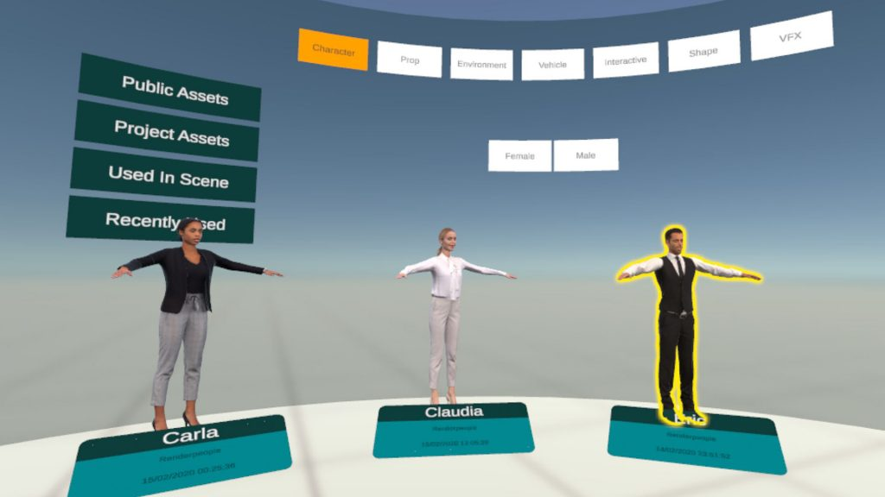

# Asset Library

Press the [Menu/B Buttons](https://firststage.moviestorm.co.uk/knowledgebase/controllers/) on both controllers at the same time to go to the Asset Library.

<figure><figcaption></figcaption></figure>

Here you can select assets to put on stage from all categories in your Asset Repository, including characters, props, environments, vehicles, interactive assets, manipulatable shapes and VFX.

In front of you is a board of topline categories and their associated tags, and a carousel of the resultant filtered assets to select from.

* Use the Left and Right buttons on the ThumbPad of either controller to rotate the carousel and show more assets.
* To select a category or tag, point and click the trigger to filter your selection.
* To select an asset to place on stage, point at it then press and hold the trigger and you will return to your scene with the asset in hand ready to place where you want.

Note that with larger assets, you will arrive on set scaled to make placement easier.
