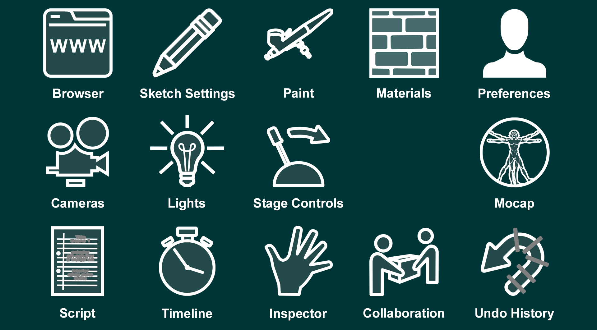

# WristPad

Look at the back of your wrist and the WristPad will reveal itself (your thumb will be pointing towards you). It is a virtual tablet that provides lots of useful functions with a familiar flat-screen interface (mostly).

The **Home Screen** shows an array of buttons that will open the main screens.

These screens and how to use them are described later in context.&#x20;

<figure><figcaption>
<mark style="background-color:red;">UPDATE</mark>
</figcaption></figure>

| Screen                                                    | Description                                        |
| --------------------------------------------------------- | -------------------------------------------------- |
| **Browser**                                               | Web Browser showing this documentation by default. |
| **Settings**                                              | Settings for sketching, snap, et al.               |
| **Paint**                                                 | Paint color & brush palette                        |
| **Materials**                                             | Materials palette for the Paint Roller             |
| **Preferences**                                           | Your working preferences                           |
| ****[**Cameras**](../cameras.md)****                      | Monitor the available cameras                      |
| **Lights**                                                | Lighting controls                                  |
| **Stage Controls**                                        | Controls for stage machinery                       |
| **Sound**                                                 | Sound mixing desk                                  |
| **Mocap**                                                 | Assign motion capture sources                      |
| ****[**Script**](script.md)****                           | Work with the script view                          |
| ****[**Timeline**](timeline.md)****                       | Work with the timeline view                        |
| ****[**Inspector**](working-with-things/inspector.md)**** | Inspect and modify the properties of things        |
| **Collaboration**                                         | Team collaboration                                 |
| ****[**Undo History**](undo-redo.md)****                  | Rewind the Undo History                            |

## Transport controls

Below the main screen, are the Transport Controls.

<figure><figcaption>
<mark style="background-color:red;">UPDATE</mark>
</figcaption></figure>

From left to right:

* Rewind to start of this section (or whole scene)
* Back a beat (useful for pose animation)
* Forward a beat (useful for pose animation)
* Go to the start of the next section (or end of last activity)
* Play / Pause
* Record / Pause
* Current timeline position
* Clock synchronisation (used when collaborating)

## Home Screen Button

 Use the arrow to go back to the Home Screen from any control panel.

